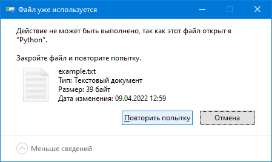

Лекция 2. Файловый ввод-вывод
=============================

Основные понятия: файлы, пути к файлам
--------------------------------------

**Файл** — именованная область в долговременной памяти (на диске). Правила,
определяющие допустимые имена файлов, зависят от используемой файловой
системы.

Если имя файла включает как минимум один знак `.`, то часть имени
от последнего знака `.` и до конца называется **расширением.** Как правило,
расширение указывает тип содержимого файла: `.jpg` — картинка в формате JPEG,
`.txt` — текстовый файл, `.exe` — исполнимый файл ОС Windows, `.py` — исходный
текст на языке Python и т.д.

Часто интерфейс операционной системы скрывает расширения файлов, т.е. файлы
с именами `input.txt` и `program.py` будут отображаться как `input`
и `program`. Распространённая ошибка — забыть о том, что расширения скрываются
и добавить «лишнее» расширение, создав, например, текстовый файл
`input.txt.txt` — в папке он будет показываться как `input.txt`,
т.к. расширение будет скрыто. Но при этом программа на Python не сможет найти
файл `input.txt`, т.к. реально его в папке нет — есть файл с именем
`input.txt.txt`.

**Файловая система** — способ хранения данных в долговременной памяти,
использующий именованные файлы.

**Папка (каталог, «директория»)** — именованная группа файлов. Как правило,
файл находится только в одной папке. Некоторые файловые системы позволяют
одному файлу находиться в нескольких папках одновременно, но это редкая
и специфическая практика.

Папки тоже являются файлами (специального вида) и могут находиться внутри
других папок. Если папка `A` находится внутри папки `B`, то папка `B` для
папки `A` считается родительской. **Корневая папка (корневой каталог)** —
папка, у которой нет родительской.

**Путь к файлу** — строка, описывающая расположение файла в файловой системе.

У запущенной программы одна из папок файловой системы является **текущей** —
это своего рода неявная глобальная переменная.

Пути к файлам могут быть относительными и абсолютными. Относительный путь
к файлу указывается, начиная с _текущей папки,_ абсолютный путь к файлу —
начиная с _корневой папки._

В каждой папке (кроме корневой) неявно присутствуют две имени файла — ссылка
на текущую папку (записывается как одинарная точка `.`) и ссылка на родительскую
папку (записывается как две точки: `..`). Они используются, чтобы
в относительном пути ссылаться на текущую папку или на родительскую.

Путь к файлу включает в себя перечисление имён папок, в которые нужно перейти
относительно текущей или корневой папки, чтобы добраться до файла плюс в конце
само имя файла.

Если файл находится в текущей папке, то относительный путь к нему состоит
из одного имени файла.

Правила записи пути к файлу зависят от операционной системы.

### Особенности путей к файлам на Windows

На Windows компоненты пути разделяются знаками прямой `/` и обратной `\`
косой черты. Причём в интерфейсе (командная строка, элементы графического
интерфейса) обратная косая черта `\` работает всегда, прямая `/` не всегда
(из соображений совместимости по историческим причинам).

Относительный путь к файлу — перечисление имён папок с именем целевого
файла в конце, разделителем служат знаки `/` или `\`. Текущих папок
на Windows может быть несколько, у каждой буквы диска — своя текущая папка,
поэтому относительный путь на Windows может начинаться с буквы диска
и двоеточия.

Абсолютный путь к файлу начинается с разделителя папок (т.е. `/` или `\`),
который может предваряться буквой диска. Если буква диска не указана,
то подразумевается текущая буква диска.

    Абсолютные пути к файлу:
    • D:\Mazdaywik\Documents\Преподавание\L4\b-02 Файловый ввод-вывод.md
    • D:/Mazdaywik/Documents/Преподавание/L4/b-02 Файловый ввод-вывод.md
    • \Mazdaywik\Documents\Преподавание\L4\b-02 Файловый ввод-вывод.md
    • C:\Program Files\Far Manager\Far.exe
    • C:\Windows\System32\notepad.exe

    Относительные пути:
    • b-02 Файловый ввод-вывод.md
    • D:b-02 Файловый ввод-вывод.md
    • C:Far.exe
    • 2020-2021\rk1.pdf
    • ..\curricula.ref
    • ../curricula.ref

Первые три примера — файл, который я сейчас пишу, а вы сейчас читаете.

Последние два примера означают переход в родительскую папку. Абсолютный путь
для него выглядит как

    • D:/Mazdaywik/Documents/Преподавание/curricula.ref

(т.к. текущая папка — `D:\Mazdaywik\Documents\Преподавание\L4`).

В именах файлов на Windows запрещены знаки `"`, `\`, `/`, `<`, `>`, `:`, `*`,
`?`. Некоторые имена файлов зарезрвированы — `nul`, `prn`, `con`, `com1`,
`lpt1`, `aux` и ряд других — нельзя создать файл с этим именем и любым
расширением (например, `nul.txt`, `con.jpg`, `aux.py` и т.д.)

Имена файлов не чувствительны к регистру — заглавные и строчные буквы считаются
одинаковыми. Файл с именем `штукатурка.txt` можно открыть, используя имена

• `Штукатурка.txt`
• `ШТУКАТУРКА.TXT`
• `ШтукаТурка.txt`
• `штукаТУРКА.tXt`
• `ШтУкАтУрКа.TxT`

### Особенности путей к файлам на unix-подобных ОС (Linux и macOS)

Здесь всё проще. Разделителем компонентов в пути является только знак `/`.
Корень у файловой системы один, букв диска нету. Вместо этого для подключаемых
устройств (например, флешек) создаются отдельные папки, внутри которых
отображается содержимое устройства.

Примеры путей к файлам:

    Абсолютные пути:
    • /usr/bin/python3
    • /home/username/Documents/Таблица.docx
    • /media/My Flash Drive/Music/Моргенштерн.mp3

    Относительные пути:
    • Documents/Таблица.docx
    • ../Pictures/facepalm.jpg

На Linux в именах файлов допустимы _любые знаки,_ кроме знака `/` (т.к. он
зарезервирован для разделителя путей), в отличие от Windows, зарезервированных
имён нет (кроме `.` — ссылки на текущую папку и `..` — ссылка на родительскую).

На Linux имена файлов учитывают регистр символов — большие и маленькие буквы
считаются разными. Имена файлов `hello.txt` и `HELLO.TXT` — это имена двух
разных файлов.

На macOS регистр имён файлов, как и на Windows, не учитывается.

**Текстовый файл** — файл, хранящий в себе последовательность текстовых строк.
Строки в текстовом файле разделяются знаками перевода строки `\n`. Символы,
содержащиеся в строках, представляются байтами или последовательностями
байтов при помощи так называемых **кодировок** — наборов правил представления
символов в виде байтов.

Однобайтовые кодировки (вроде Windows-1251 для кириллицы) представляют каждый
символ в виде одного байта, поэтому поддерживают только небольшой набор символов
(не более 256 включая управляющие символы). Например, кодировка Windows-1251
для кириллицы поддерживает только кириллические и латинские буквы, цифры, набор
основных знаков пунктуации и математических знаков.

Многобайтные кодировки (UTF-8, UTF-16, UTF-32, некоторые кодировки для азиатских
языков с иероглифами) сопоставляют одному символу несколько байтов, позволяют
хранить гораздо больший набор символов. В частности, кодировка UTF-8
представляет все символы стандарта UNICODE, в частности, буквы алфавитов
большинства языков (включая иероглифы, деванагари и прочее), разнообразные
знаки пунктуации и математические знаки, эмодзи и т.д. В UTF-8 латинские буквы,
цифры и основные знаки пунктуации кодируются 1 байтом, кириллические, греческие
буквы, иврит и некоторые другие алфавиты — 2 байтами, иероглифы и эмодзи —
3 или 4 байта.

Python поддерживает работу с символами стандарта UNICODE.

Работа с файлами в Python
-------------------------
Для того, чтобы взаимодействовать с файлом, его нужно сначала _открыть_ —
создать объект файла, через который можно с ним взаимодействовать (читать
или писать).

После работы с файлом, его нужно обязательно _закрыть_ — сообщить операционной
системе, что мы с ним больше не работаем.

Несколько программ могут одновременно открыть файл для чтения и читать его.
Но если одна из программ открыла файл для записи, то другие программы, как
правило, не могут этот файл открыть, как на чтение, так и на запись (детали
поведения зависят от операционной системы).

На Windows, в частности, если файл открыт в программе, то его нельзя удалить —
получим сообщение о том, что файл занят. Если открыт файл на флешке,
то Windows не даст эту флешку безопасно извлечь.

Максимально число одновременно открытых файлов ограничено, количество зависит
от настроек операционной системы (как-то я делал опыт, на Windows не удалось
открыть более 4000 файлов одновременно).

Запись в файлы буферизуется — данные, которые записываются в файл, сначала
записываются в область оперативной памяти, т.н. «буфер», когда «буфер»
заполняется, выполняется реальна запись на диск. Буфер сбрасывается при закрытии
файла.

По этим причинам файл нужно не забывать закрывать.

### Открытие файлов
Файл открывается при помощи встроенной функции `open()`. Синтаксис:

    open(‹путь-к-файлу›, ‹режим›, encoding=‹кодировка›)

* Первый параметр (обязательный) — путь к файлу (строка).
* Второй параметр — режим. Режим может быть
  * `r` (read) — чтение текстового файла,
  * `w` (write) — перезапись текстового файла,
  * `a` (append) — дозапись в конец текстового файла,
  * `rb`, `wb`, `ab` (binary) — чтение, перезапись или дозапись двоичного
    файла.
  * Если режим файла не указан, то подразумевается `r`.
* Параметр `encoding` задаёт кодировку файла, используется для текстовых
  файлов. Рекомендуется всегда указывать кодировку `'utf-8'`. Кодировку
  можно не указывать, если в файл пишутся только символы с кодами меньше
  127 (латинские буквы, цифры, основные знаки препинания)

Примеры:

    # Текстовый файл открыт для чтения
    f1 = open('file1.txt', 'r', encoding='utf-8')

    # Тоже самое, режим 'r' подразумевается
    f2 = open('file1.txt', encoding='utf-8')

    # Здесь будет использована кодировка по умолчанию
    # (1251 на Windows, UTF-8 на Linux и macOS)
    f3 = open('file1.txt')

    # Текстовый файл открыт для перезаписи
    f4 = open('file2.txt', 'w', encoding='utf-8')

    # Текстовый файл открыт для дозаписи в конец
    f5 = open('file3.txt', 'a', encoding='utf-8')

    # Двоичный файл открыт для чтения
    f6 = open('picture.jpg', 'rb')

    # Закрытие всех файлов
    f1.close()
    f2.close()
    f3.close()
    f4.close()
    f5.close()
    f6.close()

Файл закрывается при помощи вызова метода `.close()`. Python может сам
закрывать файлы, но не всегда, поэтому `.close()` лучше вызывать явно.

### Чтение файлов
Мы будем рассматривать только чтение текстовых файлов.

Для чтения файлов используются следующие методы:

* `.read(count)` — прочитать `count` символов из файла,
* `.read()` — прочитать всё содержимое файла от текущей позиции до конца,
* `.readline()` — прочитать очередную строку из файла,
* `.readlines()` — прочитать все строки из файла, функция возвращает
  список строк.

Строки, которые возвращают `.readline()` и `.readlines()`, завершаются
символом перевода строки `\n`. Для того, чтобы эти символы стереть,
можно использовать вызов метода `.rstrip('\n')`, либо вообще `.strip()`,
если нас не интересуют ни начальные, ни конечные пробельные символы.

Сам объект текстового файла, открытого на чтение, является итератором,
который при переборе читает очередную строку (неявно вызывая `.readline()`).

**Пример** функции, которая распечатывает содержимое файла с заданным именем.

    def print_file(filename):
        fin = open(filename, 'r', encoding='utf-8')
        for line in fin:
            print(line.rstrip('\n'))
        fin.close()

Здесь мы не пользуемся методами для чтения файла, мы пользуемся тем, что
объект файла является итератором — может быть прочитан в цикле `for`. Цикл
будет перебирать все строки файла, как если бы они были прочитаны при помощи
метода `.readline()`.

В конце прочитанных строк будет находиться знак перевода строки (`\n`), кроме,
возможно, последней — она на знак `\n` может не завершаться. Поэтому для
удаления `\n` на конце мы используем метод `.rstrip('\n')`, указывая в качестве
параметра удаляемый символ.

Альтернативное решение — вручную проверять, что если строка заканчивается
на `\n`, то мы её обрезаем, иначе не трогаем. Обрезать последний символ без
проверки нельзя, т.к. в последней строке знак перевода может отсутствовать.

Если знаки `\n` не обрезать, то на печать будут выводиться лишние пустые
строки, т.к. `print()` при печати строки сам добавляет в конец знак `\n`.

Другой, более короткий способ прочитать всё содержимое файла — использовать
метод `.read()`:

    def print_file(filename):
        fin = open(filename, 'r', encoding='utf-8')
        print(fin.read())
        fin.close()

Мы при помощи метода `.read()` читаем весь файл до конца, всё содержимое
файла загружается в оперативную память в виде одной большой строки — эту
строку распечатываем при помощи `print()`. Такое решение нормально работает
только с небольшими файлами — файлами, размер которых измеряется не более
чем мегабайтами. Для гигабайтных файлов так делать не надо — памяти может
не хватить.

### Запись файлов
Для того, чтобы записывать в файл, его нужно открыть в соответствующем режиме.
Режимов записи два:

* Режим перезаписи файла — `'w'` (от слова write). Если файл не существовал,
  то он при открытии будет создан и его размер будет равен нулю. Если файл
  уже существовал, то он будет перезаписан — всё его содержимое сотрётся,
  его размер станет равным 0 байт.
* Режим дозаписи в файл — `'a'` (от слова append). Если файл не существовал,
  он будет создан и будет иметь размер 0 байт. Если файл уже существовал,
  то данные в нём останутся как есть, новая запись будет осуществляться
  в конец файла.

Пример:

    >>> f = open('example.txt', 'w', encoding='utf8')
    >>> f.write('Один!')
    5
    >>> f.close()
    >>> f = open('example.txt', 'w', encoding='utf8')
    >>> f.write('Два!')
    4
    >>> f.close()

После этих манипуляций в файле `example.txt` будет записано только слово

    Два!

т.к. мы открывали файл для перезаписи. После первого «сеанса» работы с файлом
(вызовы `open()`, `.write()` и `.close()`) в файле оказалось слово `Один!`.
Когда мы открыли файл второй раз для перезаписи (в режиме `'w'`), всё
содержимое файла стёрлось, и вместо него мы записали слово `Два!`.

Если мы файл удалим, а затем сделаем тоже самое, используя уже режим `'a'`
(дозапись):

    >>> f = open('example.txt', 'a', encoding='utf8')
    >>> f.write('Один!')
    5
    >>> f.close()
    >>> f = open('example.txt', 'a', encoding='utf8')
    >>> f.write('Два!')
    4
    >>> f.close()

то в файле `example.txt` у нас окажется

    Один!Два!

При первом открытии (несуществующего) файла файл будет создан пустым и в него
будет записано `Один!`. При втором открытии содержимое файла не изменится,
новая запись будет осуществляться в конец — в конце допишется `Два!`.

#### Метод `.write()`
Метод `.write(s)` принимает в качестве параметра строку и записывает её в файл.
Возвращаемое значение — количество записанных символов. Обычно возвращаемое
значение совпадает с длиной строки. Редко, если на диске закончилось доступное
место, строка может записана не полностью и возвращаемое значение будет меньше
длины. Обычно об этом не задумываются и возвращаемое значение не анализируют.

Нужно помнить, что метод `.write()` при записи строки в файл не добавляет
в конце знак перевода строки `'\n'`. Если формировать файл при помощи метода
`.write()`, переводы строк нужно добавлять явно.

#### Функция `print()`

С функцией `print()` мы уже знакомы, мы ею пользовались для вывода данных
на консоль. Однако, её можно использовать и для записи в файл.

Расширенный синтаксис функции `print()`:

    print(‹значение›, ‹значение›,… sep=‹разделитель полей›,
          end=‹разделитель строк›, file=‹объект файла›)

Функция `print()`, помимо списка значений для записи, принимает несколько
необязательных параметров. Это параметры:

* `sep=‹разделитель полей›` — строка, которая разделяет выводимые значения,
  по умолчанию — один пробел `' '`.
* `end=‹разделитель строк›` — строка, которая завершает вывод строки,
  по умолчанию — перевод строки `'\n'`.
* `file=‹объект файла›` — открытый для записи (дозаписи или перезаписи)
  файл или устройство вывода, по умолчанию — вывод на консоль `sys.stdout`.

Таким образом, функция `print()` выводит значения, разделяя их пробелом,
в конце выводимой строки печатает перевод строки, вывод осуществляется в консоль
(т.е. на экран). Однако, это поведение можно изменить, указывая необязательные
параметры.

Вывод по умолчанию:

    >>> print(1, 2, 3)
    1 2 3

Сделаем разделителем другие строки:

    >>> print(1, 2, 3, sep=';')
    1;2;3
    >>> print(1, 2, 3, sep='*****')
    1*****2*****3

Выведем две строки, используя в качестве разделителя `'!'` — перевод на новую
строку осуществлён не будет:

    >>> print(1, 2, 3); print(4, 5, 6)
    1 2 3
    4 5 6
    >>> print(1, 2, 3, end='!'); print(4, 5, 6, end='!')
    1 2 3!4 5 6!

В качестве разделителя полей укажем вместо пробела по умолчанию перевод строки —
каждое значение будет распечатано на новой строчке.

    >>> print(1, 2, 3, sep='\n')
    1
    2
    3

Пример записи в файл при помощи функции `print()`:

    >>> f = open('example.txt', 'w', encoding='utf8')
    >>> print('Пишем в файл при помощи print()', file=f)
    >>> print(1, 2, 3, 4, 5, 6, file=f)
    >>> print(1, 2, 3, 4, 5, 6, sep=',', file=f)
    >>> f.close()

Функция `print()` сначала напечатала строчку, потом шесть чисел, разделяя их
пробелами (по умолчанию), затем шесть чисел, разделяя их запятой (явно указан
`sep=','`). Содержимое файла:

    Пишем в файл при помощи print()
    1 2 3 4 5 6
    1,2,3,4,5,6

Использование функции `print()` для вывода в файл удобнее, чем метод `.write()`.

### Важность закрытия файлов, оператор `with`
Для примера создадим файл, запишем в него строку и пока не закроем:

    >>> f = open('example.txt', 'w', encoding='utf8')
    >>> print('Пишем строчку в файл', file=f)

Файл в папке появился, но он почему-то пустой. Размер отображается как 0 байт,
если откроем блокнотом, то увидим пустой файл.

Причина в том, что данные при записи буферизуются — для открытого файла
в оперативной памяти выделяется участок, куда помещаются данные, подлежащие
записи. Когда эта область памяти заполняется, происходит запись данных на диск.
Буфер необходим для ускорения работы программы, т.к. операция записи на диск
гораздо более медленная, чем запись в оперативную память и имеет смысл её
выполнять реже.

Если мы файл закроем, то содержимое буфера принудительно выпишется на диск.

    >>> f.close()

После закрытия файла его размер уже не нулевой, и если откроем его блокнотом,
то увидим ожидаемое содержимое — строку

    Пишем строчку в файл

Таким образом, файлы, открытые для записи, нужно обязательно закрывать, т.к.
иначе есть риск потери данных. Если, например, интерпретатор Python’а будет
аварийно завершён, данные в буфере на диск не выпишутся.

Другая причина закрытия файлов — на Windows открытые файлы блокируются
операционной системой. Если мы откроем файл и попробуем его удалить:

    >>> f = open('example.txt', 'r', encoding='utf8')

то удалить его не удастся:

Если файл закрыть, то он успешно удалится:

    >>> f.close()

На Linux и macOS удалять открытые файлы можно.

Третья причина — нельзя одновременно открыть очень много файлов. Для примера
напишем функцию:

    def many_open_files(count):
        files = []
        for i in range(count):
            files.append(open('file' + str(i) + '.txt', 'w'))
        return files

Эта функция открывает для записи указанное количество файлов, имена файлов
при этом имеют вид `file0.txt`, `file1.txt`, …, функция возвращает список
открытых файлов.

При попытке открыть 10 тысяч файлов получим следующее сообщение об ошибке:

    >>> fs = many_open_files(10000)
    Traceback (most recent call last):
      File "<pyshell#8>", line 1, in <module>
        fs = many_open_files(10000)
      File "D:/…/example.py", line 4, in many_open_files
    OSError: [Errno 24] Too many open files: 'file8189.txt'

Таким образом, в Windows по умолчанию нельзя открыть более 8188 файлов
одновременно.

Python часто «прощает» незакрытые файлы — он их может закрыть сам. Но лучше
на это не полагаться. Не забывать каждый раз вызывать метод `.close()`
довольно утомительно, поэтому разработчики Python предусмотрели синтаксис,
гарантирующий обязательное закрытие файла:

    with open(‹параметры›) as ‹перем›:
        ‹блок кода›

Здесь `‹параметры›` — параметры функции `open()`: имя файла, режим, кодировка,
`‹перем›` — имя переменной, которой будет присвоен отрытый файл, `‹блок кода›` —
некоторый блок кода. Семантика этой конструкции следующая.

* Открывается файл,
* объект файла присваивается переменной `‹перем›`,
* выполняется `‹блок кода›`.
* При завершении выполнения блока кода, причём любым способом — при достижении
  его конца, либо завершение функции при помощи `return`, либо, если конструкция
  `with` находится внутри цикла, то при прерывании итерации при помощи `break`
  или `continue`, либо при генерации исключения (возникновении ошибки) файл,
  присвоенный переменной `‹перем›` обязательно автоматически закроется.

Пример. Подсчитаем число строк в файле.

    def count_lines(filename):
        with open(filename, 'r', encoding='utf8') as f:
            return len(f.readlines())

Функция `count_lines(filename)` принимает имя файла и возвращает число строк
в нём. Для открытия файла используется конструкция `with`, которая присваивает
открытый функцией `open()` файл в переменную `f`. Чтобы подсчитать строки
в файле, мы считываем все строки при помощи метода `.readlines()`
и возвращаем длину полученного списка. Заметим, что блок кода, управляемый
`with`, завершается при помощи `return`. Однако, файл будет закрыт, т.к. `with`
это гарантирует.
