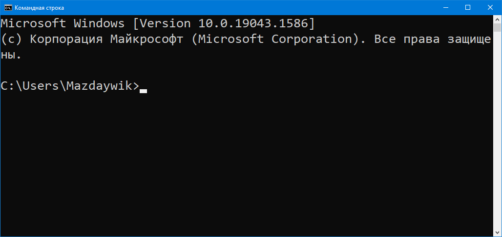
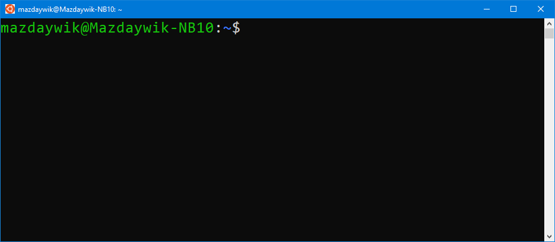

Лекция 3. Работа в оболочке ОС, написание скриптов
===============================================

<div id="toc"></div>
<script src="toc.js"></script>

Работа в текстовой оболочке операционной системы (ОС)
-----------------------------------------------------

**Оболочка операционной системы** — программа, посредством которой пользователь
может осуществлять взаимодействие с ОС: запускать другие программы и работать
с файлами. В современных ОС используются графические оболочки, однако есть
возможность и текстовые.

Графические оболочки, как правило, не предоставляют механизмов для автоматизации
повторяющихся действий, все действия выполняются интерактивно, при участии
пользователя.

Текстовые оболочки допускают как интерактивный режим — пользователь вводит
команды и наблюдает их результат, так и «пакетный» (batch) — пользователь
может создать файл со списком команд, которые будут выполняться автоматически.
Кроме того, в текстовых оболочках присутствуют средства, позволяющие
комбинировать работу нескольких программ — вывод одной программы связывать
со входом другой.

На сегодняшней лекции мы будем рассматривать основные команды и принципы
работы в оболочках `cmd.exe` на Windows и Bash на Linux и macOS.

Для запуска оболочки `cmd.exe` на Windows нужно найти пункт меню «Командная
строка» в группе «Служебные — Windows» в меню «Пуск»:

* «Пуск» → «Служебные — Windows» → «Командная строка» (Windows 10)
* «Пуск» → «Программы» → «Служебные» → «Командная строка (Windows 7)

Для запуска оболочки на Linux и macOS нужно найти приложение «Терминал» или
«Консоль» (в разных дистрибутивах Линукса оно может называться по-разному)

Командная строка Windows:



Командная строка Linux или macOS (выглядит примерно так):



У оболочки есть так называемое **приглашение** — место на экране для ввода
команды. В командной строке Windows приглашение выглядит так:

    C:\Users\Mazdaywik>

В нём отображается путь к текущей папке (у оболочки, как и у любой другой
программы, есть текущая папка) и знак `>`. Пользователь вводит команды после
знака `>`.

В оболочке Bash (используемой по умолчанию на Linux и macOS), приглашение
выглядит так:

    mazdaywik@Mazdaywik-NB10:~$

В нём отображается имя текущего пользователя, имя компьютера, знак `:`,
путь к текущей папке (знаком `~` отображается домашняя папка) и знак `$`,
после которого пользователь вводит команды.

Команды оболочки позволяют перемещаться по папкам, манипулировать файлами
(копировать, переименовывать, перемещать, удалять) и запускать другие
программы. Команды в Командной строке Windows и Bash различаются.

Общий синтаксис команды:

    ‹команда› ‹параметр1› ‹параметр2›…

Здесь `‹команда›` — это имя команды, параметры — указание режимов работы
команды и имён файлов, которыми команда манипулирует. Бывают команды, которые
вообще не принимают параметры.

Имя команды отделяется от параметров пробелом, сами параметры тоже разделяются
пробелами. Если имя команды или параметр сам должен содержать пробелы, то он
заключается в кавычки: `"двойные"` (работают и на Windows, и на Linux/macOS)
или `'одинарные'` (работают только на Linux/macOS).

Команды бывают встроенные — обрабатываются самой оболочкой, либо являются
именами программ.

Основные команды оболочки
-------------------------

### Смена текущей папки, `cd`

`cd ‹имя папки›`, работает и на Windows, и на Linux, и на macOS.

```batch
C:\Users\Mazdaywik>cd Desktop

C:\Users\Mazdaywik\Desktop>
```

```Bash
mazdaywik@Mazdaywik-NB10:~$ cd example
mazdaywik@Mazdaywik-NB10:~/example$
```

По приглашению командной строки видно, что текущая папка изменилась.
В качестве имени целевой папки можно использовать `..` для перехода
в родительскую папку.

### Создание папки, `mkdir`

Для того, чтобы создать новую пустую папку, используется команда `mkdir`:

    mkdir ‹имя новой папки›

На Windows вместо `mkdir` можно использовать более короткий синоним `md`,
на Linux и macOS — только `mkdir`.

```Bash
mazdaywik@Mazdaywik-NB10:~$ mkdir "New folder"
mazdaywik@Mazdaywik-NB10:~$ cd "New folder"
mazdaywik@Mazdaywik-NB10:~/New folder$
```

```batch
C:\Users\Mazdaywik>mkdir "New folder"

C:\Users\Mazdaywik>cd "New folder"

C:\Users\Mazdaywik\New folder>
```

### Создание текстового файла

На Windows для создания текстового файла используется команда вида

    copy con ‹имя файла›

после чего с клавиатуры нужно ввести содержимое файла. Ввод завершается
нажатием клавиш Ctrl-Z и Enter.

На Linux и macOS нужно ввести команду

    cat > ‹имя файла›

ввести содержимое файла и нажать комбинацию клавиш Ctrl-D.

```batch
C:\Users\Mazdaywik\New folder>copy con "new file.txt"
first line
second line
third line
^Z
Скопировано файлов:         1.

C:\Users\Mazdaywik\New folder>
```
```bash
mazdaywik@Mazdaywik-NB10:~/New folder$ cat > "new file.txt"
first line
second line
third line
mazdaywik@Mazdaywik-NB10:~/New folder$
```

### Просмотр содержимого папки

На Windows используется команда `dir`, которая распечатывает содержимое
папки, выводя сведения о каждом файле. Если команду вызвать с параметром `/b`,
будут выведены только имена файлов. В папке `New folder` на данный момент
всего один файл:

```batch
C:\Users\Mazdaywik\New folder>dir
 Том в устройстве C имеет метку System
 Серийный номер тома: 0052-DDD1

 Содержимое папки C:\Users\Mazdaywik\New folder

09.04.2022  14:33    <DIR>          .
09.04.2022  14:33    <DIR>          ..
09.04.2022  14:33                37 new file.txt
               1 файлов             37 байт
               2 папок  43 388 399 616 байт свободно

C:\Users\Mazdaywik\New folder>dir /b
new file.txt

C:\Users\Mazdaywik\New folder>
```

На Linux и macOS используется команда `ls`, которая распечатывает имена
файлов в папке. Если указать параметр `-l`, то будут распечатаны подробные
сведения:

```bash
mazdaywik@Mazdaywik-NB10:~/New folder$ ls
'new file.txt'
mazdaywik@Mazdaywik-NB10:~/New folder$ ls -l
total 4
-rw-r--r-- 1 mazdaywik mazdaywik 34 Apr  9 14:34 'new file.txt'
mazdaywik@Mazdaywik-NB10:~/New folder$
```

### Копирование файлов

На Windows используется команда

    copy ‹исходный файл› ‹имя копии›
    copy ‹исходный файл› ‹целевая папка›

На Linux и macOS:

    cp ‹исходный файл› ‹имя копии›
    cp ‹исходный файл› ‹целевая папка›

Для примера скопируем файл `new file.txt` в `copy.txt`:

```batch
C:\Users\Mazdaywik\New folder>copy "new file.txt" copy.txt
Скопировано файлов:         1.

C:\Users\Mazdaywik\New folder>dir
 Том в устройстве C имеет метку System
 Серийный номер тома: 0052-DDD1

 Содержимое папки C:\Users\Mazdaywik\New folder

09.04.2022  14:41    <DIR>          .
09.04.2022  14:41    <DIR>          ..
09.04.2022  14:33                37 copy.txt
09.04.2022  14:33                37 new file.txt
               2 файлов             74 байт
               2 папок  43 390 611 456 байт свободно
```
Команда `dir` нам показала, что в папке теперь находятся два файла.
Имя файла `new file.txt` нужно было заключать в кавычки, т.к. оно содержит
пробел. Имя целевого файла `copy.txt` пробелов не содержит, поэтому кавычки
не нужны.

На Linux:
```bash
mazdaywik@Mazdaywik-NB10:~/New folder$ cp "new file.txt" copy.txt
mazdaywik@Mazdaywik-NB10:~/New folder$ ls -l
total 8
-rw-r--r-- 1 mazdaywik mazdaywik 34 Apr  9 14:43  copy.txt
-rw-r--r-- 1 mazdaywik mazdaywik 34 Apr  9 14:34 'new file.txt'
mazdaywik@Mazdaywik-NB10:~/New folder$
```

### Переименование файлов
На Windows используется команда

    ren ‹исходное имя› ‹новое имя›

На Linux и macOS:

    mv ‹исходное имя› ‹новое имя›

Переименуем файл `copy.txt` в `backup.txt`:

```batch
C:\Users\Mazdaywik\New folder>ren copy.txt backup.txt

C:\Users\Mazdaywik\New folder>dir /b
backup.txt
new file.txt

C:\Users\Mazdaywik\New folder>
```

```bash
mazdaywik@Mazdaywik-NB10:~/New folder$ mv copy.txt backup.txt
mazdaywik@Mazdaywik-NB10:~/New folder$ ls
 backup.txt  'new file.txt'
mazdaywik@Mazdaywik-NB10:~/New folder$
```

### Перемещение файлов

На Windows используется команда `move`:

    move ‹исходный файл› ‹целевой файл›
    move ‹исходный файл› ‹целевая папка›

на Linux и macOS — `mv`:

    mv ‹исходный файл› ‹целевой файл›
    mv ‹исходный файл› ‹целевая папка›

Таким образом, на Linux и macOS используется одна и та же команда и для
переименования, и для перемещения файлов.

Создадим папку `nested` в текущей папке и переместим в неё файл `backup.txt`:

```batch
C:\Users\Mazdaywik\New folder>mkdir nested

C:\Users\Mazdaywik\New folder>move backup.txt nested
Перемещено файлов:         1.

C:\Users\Mazdaywik\New folder>dir /b
nested
new file.txt

C:\Users\Mazdaywik\New folder>dir /b nested
backup.txt

C:\Users\Mazdaywik\New folder>
```

Мы создали папку `nested`, переместили в неё файл `backup.txt`, посмотрели
содержимое текущей папки и содержимое папки `nested`. Как видим, команда
`dir` может принимать имя папки, содержимое которой нужно распечатать. Если
имя не указано, то распечатывается содержимое текущей папки.

```bash
mazdaywik@Mazdaywik-NB10:~/New folder$ mkdir nested
mazdaywik@Mazdaywik-NB10:~/New folder$ mv backup.txt nested
mazdaywik@Mazdaywik-NB10:~/New folder$ ls
 nested  'new file.txt'
mazdaywik@Mazdaywik-NB10:~/New folder$ ls nested
backup.txt
mazdaywik@Mazdaywik-NB10:~/New folder$
```
На Linux и macOS команда `ls` также поддерживает указание имени папки,
которую нужно распечатать.


### Удаление файлов
На Windows используется команда `del` или `erase` (это два синонима), которая
принимает имя удаляемого файла:

    del ‹имя файла›
    erase ‹имя файла›

На Linux и macOS такая команда называется `rm`:

    rm ‹имя файла›

Удалим файл `backup.txt` в папке `nested`:

```batch
C:\Users\Mazdaywik\New folder>del nested\backup.txt

C:\Users\Mazdaywik\New folder>dir /b nested

C:\Users\Mazdaywik\New folder>
```
```bash
mazdaywik@Mazdaywik-NB10:~/New folder$ rm nested/backup.txt
mazdaywik@Mazdaywik-NB10:~/New folder$ ls nested
mazdaywik@Mazdaywik-NB10:~/New folder$
```
Команды `dir /b` и `ls` ничего не вывели, т.к. папки пустые.

### Удаление папок
Для удаления папки используется команда `rmdir` на всех трёх рассматриваемых
операционных системах. На Windows можно использовать более короткий синоним
`rd`. Команда `rmdir` (`rd`) может удалить только пустой каталог, в противном
случае выдаст ошибку.

Удалим папку `nested`:

```batch
C:\Users\Mazdaywik\New folder>rmdir nested

C:\Users\Mazdaywik\New folder>dir /b
new file.txt

C:\Users\Mazdaywik\New folder>
```
```bash
mazdaywik@Mazdaywik-NB10:~/New folder$ rmdir nested
mazdaywik@Mazdaywik-NB10:~/New folder$ ls
'new file.txt'
mazdaywik@Mazdaywik-NB10:~/New folder$
```

### Просмотр содержимого файла
Для того, чтобы вывести на экран содержимое файла, на Windows используется
команда `type`:

    type ‹имя файла›

На Linux и macOS — `cat`:

    cat ‹имя файла›

Посмотрим содержимое файла `new file.txt`:

```batch
C:\Users\Mazdaywik\New folder>type "new file.txt"
first line
second line
third line

C:\Users\Mazdaywik\New folder>
```

```bash
mazdaywik@Mazdaywik-NB10:~/New folder$ cat "new file.txt"
first line
second line
third line
mazdaywik@Mazdaywik-NB10:~/New folder$
```

### Очистка экрана
Чтобы стереть содержимое окна консоли, нужно выполнить команду `cls`
на Windows или `clear` на Linux/macOS.

### Запуск консоли Python в консоли оболочки

На Windows, если Python установлен правильно, нужно ввести команду `python`,
на Linux и macOS — `python3` (т.к. команда `python` без цифры на конце
может запустить Python 2.7 на некоторых дистрибутивах Linux или версиях macOS).

```
C:\Users\Mazdaywik\New folder>python
Python 3.9.5 (tags/v3.9.5:0a7dcbd, May  3 2021, 17:27:52) [MSC v.1928 64 bit (AMD64)] on win32
Type "help", "copyright", "credits" or "license" for more information.
>>> 1+2
3
>>> exit
Use exit() or Ctrl-Z plus Return to exit
>>> exit()

C:\Users\Mazdaywik\New folder>
```
```
mazdaywik@Mazdaywik-NB10:~/New folder$ python3
Python 3.8.10 (default, Mar 15 2022, 12:22:08)
[GCC 9.4.0] on linux
Type "help", "copyright", "credits" or "license" for more information.
>>> 1+2
3
>>> exit
Use exit() or Ctrl-D (i.e. EOF) to exit
>>> exit()
mazdaywik@Mazdaywik-NB10:~/New folder$
```

### Завершение работы в оболочке
Команда `exit` (работает везде) закрывает окно оболочки.


Запуск программ на Python в оболочке
------------------------------------
Для запуска программы на Python’е нужно выполнить в оболочке команду

    python ‹имя исходного файла›
    python3 ‹имя исходного файла›

в зависимости от операционной системы.

Напишем программу, которая распечатывает фразу `Hello, World!` и запустим её.

```
C:\Users\Mazdaywik\New folder>copy con hello.py
print('Hello, World!')
^Z
Скопировано файлов:         1.

C:\Users\Mazdaywik\New folder>python hello.py
Hello, World!

C:\Users\Mazdaywik\New folder>
```
```
mazdaywik@Mazdaywik-NB10:~/New folder$ cat > hello.py
print('Hello, World!')
mazdaywik@Mazdaywik-NB10:~/New folder$ python3 hello.py
Hello, World!
mazdaywik@Mazdaywik-NB10:~/New folder$
```
На Windows программы на Python можно запускать, просто указывая имя исходного
файла — интерпретатор Python будет вызываться автоматически:

```
C:\Users\Mazdaywik\New folder>hello.py
Hello, World!

C:\Users\Mazdaywik\New folder>
```

На Linux и macOS, чтобы так сделать, нужно выполнить дополнительные действия:
добавить в начало файла специальный комментарий

    #!/usr/bin/env python3

и пометить файл как исполнимый командной `chmod +x`.

```
mazdaywik@Mazdaywik-NB10:~/New folder$ cat > hello.py
#!/usr/bin/env python3

print('Hello, World!')
mazdaywik@Mazdaywik-NB10:~/New folder$ chmod +x hello.py
mazdaywik@Mazdaywik-NB10:~/New folder$ ./hello.py
Hello, World!
mazdaywik@Mazdaywik-NB10:~/New folder$
```
Одна из особенностей оболочек Linux и macOS — для запуска программ из текущей
папки нужно явно добавлять в начало `./`, к этому надо привыкнуть.

Стандартные потоки ввода-вывода
-------------------------------
В операционных системах (и в Windows, и в unix-подобных системах macOS и Linux)
для программ, запускаемых в консоли, доступны три стандартных потока
ввода-вывода — три псевдофайла, посредством которых программы могут
взаимодействовать с пользователем и друг с другом.

* Стандартный ввод (условно называемый `stdin`) — по умолчанию связан с вводом
  с клавиатуры.
* Стандартный вывод (`stdout`) — по умолчанию связан с выводом текста на экран,
  предназначен для вывода полезных данных программы.
* Стандартный вывод ошибок (`stderr`) — тоже по умолчанию связан с экраном,
  предназначен для вывода сообщений об ошибках.

Если программа запрашивает пользовательский ввод, то, как правило, она читает
его из (псевдо)файла `stdin`, если печатает на экран — по умолчанию выводит
в (псевдо)файл `stdout`.

С точки зрения программы, стандартные потоки являются разновидностью файлов,
в большинстве языков программирования с ними можно работать точно также,
как и с обычными файлами. И у стандартного ввода тоже есть возможность
достигнуть конца файла.

Для того, чтобы ввести конец файла в операционной системе Windows, нужно
нажать комбинацию клавиш Ctrl-Z (на экране высветится `^Z`) и после этого
Enter. Для того, чтобы ввести конец файла в unix-подобных ОС, нужно нажать
Ctrl-D.

Командная строка позволяет связывать стандратные потоки с файлами и даже между
собой.

Пусть есть некоторая команда `program`, которая принимает некоторые аргументы,
кроме того, в процессе работы запрашивает пользовательский ввод с клавиатуры
и выводит что-то на экран.

```
program arg1 arg2...
```
Для того, чтобы подменить пользовательский ввод на чтение текстового файла,
нужно к команде запуска программы добавить `< «имя-файла.txt»`:

```
program arg1 arg2... < input.txt
```

При таком запуске программа не будет запрашивать у пользователя ничего
с клавиатуры, вместо этого операции чтения будут читать строчки из файла.

Рассмотрим следующую программу `greeting.py`:

```python
name = input("Введите ваше имя:")
sirname = input("Введите вашу фамилию:")

print("Привет,", name, sirname)
```

(встроенная функция `input()` запрашивает ввод с клавиатуры)

Рассмотрим запуск программы обычным образом и с использованием
перенаправления ввода:

```batch
Z:\>python greeting.py
Введите ваше имя:Александр
Введите вашу фамилию:Коновалов
Привет, Александр Коновалов

Z:\>type input.txt
Alexander
Konovalov
Z:\>python greeting.py < input.txt
Введите ваше имя:Введите вашу фамилию:Привет, Alexander Konovalov

Z:\>
```

Первый запуск демонстрирует ввод данных с клавиатуры (`stdin` связан
с клавиатурой): я вводил свои имя и фамилию (завершая ввод каждой строки
нажатием на клавишу Enter, которая вводила и перевод строки тоже), набираемый
мною текст отображался на экране и считывался из `stdin` встроенной функцией
`input()`.

Далее, при помощи команды `type` я показал, что в данной папке есть текстовый
файл `input.txt` с двумя строчками, в которых написаны, соответственно,
имя и фамилия (из-за особенностей Windows, кириллица может считываться неверно).

В третьей команде я связал стандартный ввод `stdin` с файлом `input.txt`,
в результате чего программа считывала данные не с клавиатурного ввода,
а из текстового файла — на экране видно только то, что она выводит,
но не считывает.

Можно считать, что при перенаправлении ввода стандартный ввод неявно считается
файлом, открытым в режиме `r` (для чтения).

Стандартный вывод можно перенаправить двумя способами: для перезаписи и для
дозаписи (сравни с режимами `w` и `a` функции `open()` в Python). Для того,
чтобы стандартный вывод перенаправить в файл в режиме перезаписи (если файла
не было, он будет создан, если файл был, его старое содержимое сотрётся),
нужно к команде запуска добавить `> «имя-файла.txt»`, в режиме дозаписи (если
файл был, то новые данные будут добавляться в конец) — `>> «имя-файла.txt»`:

```
program arg1 arg2... > output.txt
```
```
program arg1 arg2... >> output.txt
```

Рассмотрим тот же пример:

```batch
Z:\>python greeting.py
Введите ваше имя:Alexander
Введите вашу фамилию:Konovalov
Привет, Alexander Konovalov

Z:\>python greeting.py > output.txt
Alexander
Konovalov

Z:\>
```

В текущей папке появится файл `output.txt` со следующим содержимым:

```
Введите ваше имя:Введите вашу фамилию:Привет, Alexander Konovalov
```

Когда мы перенаправили вывод в файл `output.txt`, то, что программа до этого
выводила на экран (строчку `Введите ваше имя:` и т.д.), она стала выводить
в файл — свои имя и фамилию я писал практически наугад, не видя, что программа
меня спрашивает.

Дело в том, что в обоих случаях программа пишет в поток стандартного вывода
`stdout`, который, однако, в первом случае был связан с экраном, и мы видели,
что программа пишет, а во втором случае — с файлом, и на экран в результате
ничего не выводится (зато весь вывод попадает в файл).

Стандартный поток ошибок перенаправляют редко, для перенаправления используются
похожие команды, но перед знаками `>` и `>>` нужно указать цифру `2`:

```
program arg1 arg2... 2>errors.txt
```
```
program arg1 arg2... 2>>errors.txt
```

Описанный выше синтаксис связывания связывания стандартных потоков с файлами
одинаково работает и в Windows, и в unix-подобных системах (macOS и Linux).

Связывать стандартные потоки можно не только с файлами, но и между собой.
Если у нас есть две программы, одна из которых (назовём её `prog1`) пишет
данные на `stdout`, а вторая (назовём её `prog2`) читает данные со стандартного
ввода (`stdin`), то их можно связать в _конвейер:_

```
prog1 | prog2
```

Стандартный вывод `stdout` программы `prog1` будет связан со стандартным
вводом `stdin` программы `prog2`, то, всё, что будет выводить первая программа,
будет считывать вторая программа.

В конвейере может быть сколько угодно команд:

```
prog1 | prog2 | prog3 | prog4
```

Здесь у команд `prog2` и `prog3` связаны и стандартные вводы, и стандартные
выводы.

В командной строке unix-подобных операционных систем имеется довольно много
встроенных команд, предназначенных для обработки текстовых данных (выбор
подстрок, сортировка строчек и т.д.), эти программы удобно комбинировать
при помощи конвейеров. Командная строка Windows гораздо беднее на эти
возможности.

Возьмём текстовый файл следующего содержимого:

<details><summary>jack.txt</summary>

```
This is the house that Jack built.
This is the malt
That lay in the house that Jack built.
This is the rat, that ate the malt
That lay in the house that Jack built.
This is the cat,
That chased the rat, that ate the malt
That lay in the house that Jack built.
This is the dog, that worried the cat,
That chased the rat, that ate the malt
That lay in the house that Jack built.
This is the cow with the crumpled horn,
That tossed the dog, that worried the cat,
That chased the rat, that ate the malt
That lay in the house that Jack built.
This is the maiden all forlorn,
That milked the cow with the crumpled horn,
That tossed the dog, that worried the cat,
That chased the rat, that ate the malt
That lay in the house that Jack built.
This is the man all tattered and torn,
That kissed the maiden all forlorn,
That milked the cow with the crumpled horn,
That tossed the dog, that worried the cat,
That chased the rat, that ate the malt
That lay in the house that Jack built.
This is the priest all shaven and shorn,
That married the man all tattered and torn,
That kissed the maiden all forlorn,
That milked the cow with the crumpled horn,
That tossed the dog, that worried the cat,
That chased the rat, that ate the malt
That lay in the house that Jack built.
This is the cock that crowed in the morn,
That waked the priest all shaven and shorn,
That married the man all tattered and torn,
That kissed the maiden all forlorn,
That milked the cow with the crumpled horn,
That tossed the dog, that worried the cat,
That chased the rat, that ate the malt
That lay in the house that Jack built.
This is the farmer sowing his corn,
That kept the cock that crowed in the morn,
That waked the priest all shaven and shorn,
That married the man all tattered and torn,
That kissed the maiden all forlorn,
That milked the cow with the crumpled horn,
That tossed the dog, that worried the cat,
That chased the rat, that ate the malt
That lay in the house that Jack built.
```

</details>

Для того, чтобы найти в нём все строки, в которых упоминается некоторая
строчка, на Windows нужно использовать команду `find "искомая строка"`
(кавычки обязательны), в unix-подобных системах — `grep "искомая строка"`
(кавычки нужны, если в искомой строке есть пробелы).

Для примера, найдём в файле слово `dog`:

```
Z:\>find "dog" < jack.txt
This is the dog, that worried the cat,
That tossed the dog, that worried the cat,
That tossed the dog, that worried the cat,
That tossed the dog, that worried the cat,
That tossed the dog, that worried the cat,
That tossed the dog, that worried the cat,
That tossed the dog, that worried the cat,

Z:\>
```

Программа `find` считывает строчки со стандартного ввода и выводит их
на стандартный вывод. Аналогично работает и `grep`:

```
mazdaywik@Mazdaywik-NB10:~/modules$ grep dog < jack.txt
This is the dog, that worried the cat,
That tossed the dog, that worried the cat,
That tossed the dog, that worried the cat,
That tossed the dog, that worried the cat,
That tossed the dog, that worried the cat,
That tossed the dog, that worried the cat,
That tossed the dog, that worried the cat,
mazdaywik@Mazdaywik-NB10:~/modules$
```

Команда `sort` (есть и там, и там) сортирует строки, считанные из `stdin`,
и выводит их в алфавитном порядке на `stdout` (часть вывода опущена):

```
Z:\>sort < jack.txt
That chased the rat, that ate the malt
...
This is the cat,
This is the cock that crowed in the morn,
This is the cow with the crumpled horn,
This is the dog, that worried the cat,
This is the farmer sowing his corn,
This is the house that Jack built.
This is the maiden all forlorn,
This is the malt
This is the man all tattered and torn,
This is the priest all shaven and shorn,
This is the rat, that ate the malt

Z:\>
```

```
mazdaywik@Mazdaywik-NB10:~/modules$ sort < jack.txt
That chased the rat, that ate the malt
...
This is the cat,
This is the cock that crowed in the morn,
This is the cow with the crumpled horn,
This is the dog, that worried the cat,
This is the farmer sowing his corn,
This is the house that Jack built.
This is the maiden all forlorn,
This is the malt
This is the man all tattered and torn,
This is the priest all shaven and shorn,
This is the rat, that ate the malt
mazdaywik@Mazdaywik-NB10:~/modules$
```

Найдём все строчки, содержащие слово `This`, отсортирует их по алфавиту
и результат сложим в файл с именем `this.txt`:

```
Z:\>find "This" < jack.txt | sort > this.txt
```
```
mazdaywik@Mazdaywik-NB10:~/modules$ grep This < jack.txt | sort > this.txt
```

В обоих случаях получим файл `this.txt` со следующим содержимым:

```
This is the cat,
This is the cock that crowed in the morn,
This is the cow with the crumpled horn,
This is the dog, that worried the cat,
This is the farmer sowing his corn,
This is the house that Jack built.
This is the maiden all forlorn,
This is the malt
This is the man all tattered and torn,
This is the priest all shaven and shorn,
This is the rat, that ate the malt
```

Как видно, можно выполнить достаточно сложную задачу (выбрать из файла строки,
содержащие некоторую подстроку, отсортировать их по алфавиту и записать
результат в новый файл), скомбинировав вызовы нескольких встроенных команд
операционной системы при помощи перенаправления стандатных потоков.

В обоих случаях у программы поиска подстроки (`find` или `grep`) стандартный
ввод связывался с исходным файлом, стандартный вывод — со следующей программой
в конвейере — командой сортировки `sort`. Её стандартный вывод перенаправлялся
в целевой файл.

Для программ, работающих в командной строке, принято соглашение:

* Если среди аргументов командной строки имена файлов не указаны, то чтение
  осуществляется со стандартного ввода.
* Если имена файлов указаны, что обрабатываются все перечисленные файлы.
* Результат работы программы выводится на стандартный вывод.

Таким образом, командам `grep`, `find`, `sort` и другим встроенным командам
можно в командной строке указывать и имена файлов:

```
sort input.txt
```
```
grep 'какая-то строчка' one.txt two.txt three.txt
```
```
find "какая-то строчка" one.txt two.txt three.txt
```

В операционных системах предусмотрены некоторые псевдофайлы со специальными
именами, которые не соответствуют реальным данным на диске, чтение и запись
с ними особым образом обрабатываются операционной системой.

На Windows наиболее употребительными являются файлы с именами `nul` и `con`.
Чтение из файла `nul` сразу же приводит к обнаружению конца файла (т.е.
этот файл воспринимается как пустой), запись в него игнорируется. Чтение
из файла `con` соответствует чтению с клавиатуры (даже если стандартный ввод
перенаправлен), запись в него соответствует записи на экран (даже если
перенаправлен станадартный вывод). Файлы `nul` и `con` неявно присутствуют
в каждой папке.

На unix-подобных системах чаще всего используется файл `/dev/null`, аналогичный
файлу `nul` на Windows: при чтении он воспринимается как пустой (сразу же
встречаем конец файла), при записи записываемые данные игнорируются.

Файлы `nul` и `/dev/null` используются в командной строке для того, чтобы
подавить вывод на экран:

```
C:\…>program args... > nul
```
```
user@comp:~/...$ program args... > /dev/null
```

С псевдофайлом `con` мы работали, когда создавали текстовый файл из командной
строки на Windows:

```
C:\Users\Mazdaywik\New folder>copy con "new file.txt"
first line
second line
third line
^Z
Скопировано файлов:         1.

C:\Users\Mazdaywik\New folder>
```

Команда `cat` в unix-системах читает указанные в командной строке файлы
и выводит их содержимое на стандартный вывод. Если файлы не указаны, то она
выводит на стандартный вывод содержимое стандартного ввода. Когда мы создавали
файл в командной строке Linux, мы просто перенаправляли стандартный вывод:

```
mazdaywik@Mazdaywik-NB10:~/New folder$ cat > "new file.txt"
first line
second line
third line
mazdaywik@Mazdaywik-NB10:~/New folder$
```

Взаимодействие программ на Python с операционной системой
---------------------------------------------------------
Для взаимодействия с операционной системой используется модуль `os`,
подключаемый командной

```python
import os
```

Чтобы посмотреть перечень всех доступных средств, нужно в среде IDLE
ввести следующую команду:

```python
>>> import sys
>>> help(sys)
```

Нам все эти средства не нужны, кроме двух основных:

* доступ к стандартным потокам ввода-вывода,
* доступ к аргументам командной строки.

Стандартные потоки ввода-вывода доступны как переменные

* `sys.stdin`
* `sys.stdout`
* `sys.stderr`

В этих переменных находятся объекты файлов, связанные со стандартными потоками.
Их можно использовать в файловых операциях точно также, как и объекты файлов,
полученные из функции `open()`.

При запуске программ в среде IDLE конец файла для `sys.stdin` вводится как
Ctrl-D в новой строчке независимо от операционной системы, вывод на `sys.stdout`
отображается синим цветом, на `sys.stderr` — красным цветом.

Пример: используем `.readlines()` для `sys.stdin`.

```python
>>> sys.stdin.readlines()
one
two
three
>>> ['one\n', 'two\n', 'three\n']
```

Пример: выводим на `sys.stderr`:

```python
>>> print("Напечатается синим")
Напечатается синим
>>> print("Напечатается красным", file=sys.stderr)
Напечатается красным
>>>
```

Мы говорили о том, что функция `print()` по умолчанию пишет на экран, чтобы
перенаправить вывод в файл, мы использовали параметр `file=`. Если быть точным,
функция `print()` всегда пишет в файл, по умолчанию `file=sys.stdout`.

Для доступа к аргументам командной строки используется переменная `sys.argv`,
в которой находится список аргументов. Этот список всегда непустой, т.к.
значением нулевого элемента списка `sys.argv[0]` является имя самой запущенной
программы. Для примера создадим файл `test-argv.py` со следующим содержимым:

```python
import sys

for i, arg in enumerate(sys.argv):
    print(i, arg)
```

Запустим его:

```
Z:\>python test-argv.py one two three
0 test-argv.py
1 one
2 two
3 three

Z:\>
```
```
mazdaywik@Mazdaywik-NB10:~/modules$ python3 test-argv.py one two three
0 test-argv.py
1 one
2 two
3 three
```
Действительно, нулевой аргумент — имя запущенной программы, остальные —
параметры, указанные после имени. Если параметр содержит пробелы, его нужно
заключить в кавычки:

```
Z:\>python test-argv.py "with space" without space
0 test-argv.py
1 with space
2 without
3 space
```

Пробел между словами `with space` стал частью параметра, т.к. внутри кавычек,
пробел между словами `without` и `space` стал разделителем параметров.

**Пример.** Напишем программу `cat.py`, имитирующую работу программы `cat`
в unix-системах. Программа `cat` читает файлы, перечисленные в командной
строке, каждый из них открывает и выводит его содержимое на стандартный
вывод. Если имена файлов отсутствуют, то читается стандартный ввод.

```python
import sys


def main():
    if len(sys.argv) == 1:
        process_stream(sys.stdin)
    else:
        for name in sys.argv[1:]:
            with open(name) as stream:
                process_stream(stream)


def process_stream(stream):
    sys.stdout.write(stream.read())


if __name__ == "__main__":
    main()
```

Программа написана в рекомендуемом стиле для консольных программ.

В программе объявлены две функции `main()` и `process_stream()`, в самом конце
вызывается функция `main()`. Условие `__name__ == "__main__"` выполняется
всегда при обычном запуске программы.

За счёт того, что основной код программы сосредоточен в функции `main()`,
а не «размазан» по всему исходнику, понимание программы упрощается, кроме того,
в основном коде мы можем вызывать функции до их объявления.

Функция `main()` описывает обычную логику для консольных программ: обрабатывать
либо файлы (если указаны явно), или стандартный ввод. Поскольку обработка и того,
и другого выполняется одинаково, эта логика вынесена во вспомогательную функцию
`process_stream()`.

Убедимся, что функция работает, как мы ожидаем:

```
mazdaywik@Mazdaywik-NB10:~/modules$ python3 cat.py test-argv.py this.txt
import sys

for i, arg in enumerate(sys.argv):
    print(i, arg)
This is the cat,
This is the cock that crowed in the morn,
This is the cow with the crumpled horn,
This is the dog, that worried the cat,
This is the farmer sowing his corn,
This is the house that Jack built.
This is the maiden all forlorn,
This is the malt
This is the man all tattered and torn,
This is the priest all shaven and shorn,
This is the rat, that ate the malt
mazdaywik@Mazdaywik-NB10:~/modules$ cat
hello!
hello!
mazdaywik@Mazdaywik-NB10:~/modules$ python3 cat.py
hello!
hello!
mazdaywik@Mazdaywik-NB10:~/modules$
```

Мы видим, что поведение встроенной программы `cat` и написанной нами `cat.py`
идентично на Linux. Кроме того, программа `cat.py` будет работать и на Windows:

```
Z:\>python cat.py test-argv.py this.txt
import sys

for i, arg in enumerate(sys.argv):
    print(i, arg)
This is the cat,
This is the cock that crowed in the morn,
This is the cow with the crumpled horn,
This is the dog, that worried the cat,
This is the farmer sowing his corn,
This is the house that Jack built.
This is the maiden all forlorn,
This is the malt
This is the man all tattered and torn,
This is the priest all shaven and shorn,
This is the rat, that ate the malt

Z:\>
```

**Пример.** Напишем программу `grep.py`, имитирующую работу встроенной программы
`grep` unix-подобных систем. Программа принимает в качестве первого параметра
искомую подстроку, после которой может следовать несколько имён файлов. Программа
выводит все строки указанных файлов, содержащие данную подстроку. Если указано
два и более файлов, то в начало выводимой строки добавляется имя сканируемого
файла. Если файлы не указаны, читается стандартный ввод. Программа может
принимать ключ `-v`, говорящий о том, что вывод нужно инвертировать, т.е.
выводить строки, _не содержащие_ указанной подстроки.

(На самом деле, сходство будет неточное, т.к. программа `grep` принимает
_шаблон,_ а наша программа — подстроку. Кроме того, ключей у команды `grep`
на самом деле очень много, а у нас будет только один `-v`.)

Для простоты будем считать, что ключ `-v` указывается перед искомой подстрокой.

```python
import sys


def main():
    v = False
    argv = sys.argv[1:]
    if len(argv) > 0 and argv[0] == '-v':
        v = True
        argv = argv[1:]

    if len(argv) == 0:
        print(sys.argv[0]
              + ': Не указана строка поиска',
              file=sys.stderr)
        return

    search_string = argv[0]
    files = argv[1:]

    if len(files) == 0:
        process(search_string, sys.stdin, None, v)
    elif len(files) == 1:
        with open(files[0]) as stream:
            process(search_string, stream, None, v)
    else:
        for name in files:
            with open(name) as stream:
                process(search_string, stream, name, v)


def process(search_string, stream, name, v):
    if name != None:
        prefix = name + ':'
    else:
        prefix = ''

    for line in stream:
        found = (search_string in line)
        if not v:
            if found:
                print(prefix + line, end='')
        else: # -v указан
            if not found:
                print(prefix + line, end='')


if __name__ == "__main__":
    main()
```

Функция `process` принимает, помимо потока, который нужно просканировать,
искомую строку, имя файла и факт наличия параметра `-v`. Переменная `prefix`
содержит строку, добавляемую в начало вывода каждой строки: она пустая,
если имя файла печатать не надо (сканируется стандартный ввод или файл один),
в ней имя файла и двоеточие в остальных случаях.

Код функции `process` можно несколько сократить:

```python
def process(search_string, stream, name, v):
    if name != None:
        prefix = name + ':'
    else:
        prefix = ''

    for line in stream:
        found = (search_string in line)
        if found != v:
            print(prefix + line, end='')
```

Можно убедиться, что написанная программа правильно повторяет поведение
встроенной команды `grep`:

```
mazdaywik@Mazdaywik-NB10:~/modules$ grep if cat.py grep.py
cat.py:    if len(sys.argv) == 1:
cat.py:if __name__ == "__main__":
grep.py:    if len(argv) > 0 and argv[0] == '-v':
grep.py:    if len(argv) == 0:
grep.py:    if len(files) == 0:
grep.py:    elif len(files) == 1:
grep.py:    if name != None:
grep.py:        if found != v:
grep.py:if __name__ == "__main__":
mazdaywik@Mazdaywik-NB10:~/modules$ python3 grep.py if cat.py grep.py
cat.py:    if len(sys.argv) == 1:
cat.py:if __name__ == "__main__":
grep.py:    if len(argv) > 0 and argv[0] == '-v':
grep.py:    if len(argv) == 0:
grep.py:    if len(files) == 0:
grep.py:    elif len(files) == 1:
grep.py:    if name != None:
grep.py:        if found != v:
grep.py:if __name__ == "__main__":
mazdaywik@Mazdaywik-NB10:~/modules$ grep for test-argv.py
for i, arg in enumerate(sys.argv):
mazdaywik@Mazdaywik-NB10:~/modules$ grep -v for test-argv.py
import sys

    print(i, arg)
mazdaywik@Mazdaywik-NB10:~/modules$ python3 grep.py for test-argv.py
for i, arg in enumerate(sys.argv):
mazdaywik@Mazdaywik-NB10:~/modules$ python3 grep.py -v for test-argv.py
import sys

    print(i, arg)
mazdaywik@Mazdaywik-NB10:~/modules$
```
